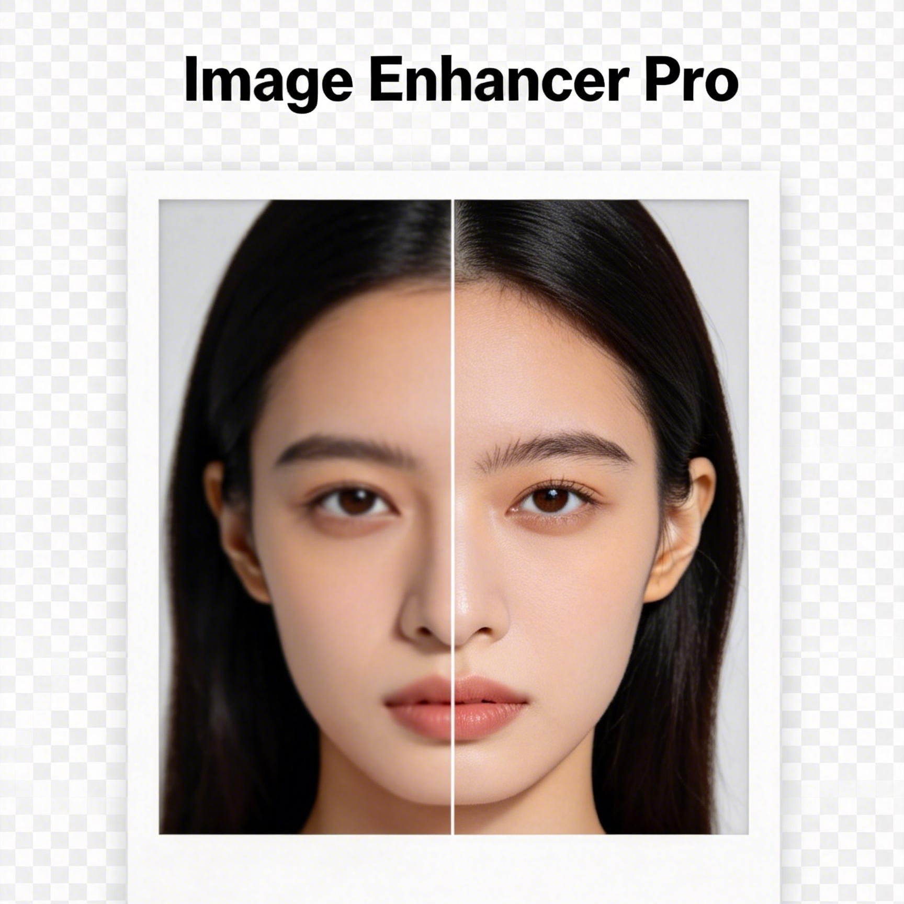

# Image Enhancer Pro



A Chrome extension for portrait enhancement with a fidelity-first pipeline.

## Highlights

- 2x / 4x enhancement with `Fidelity`, `Balanced`, and `Sharp` modes.
- Side-by-side compare slider in popup.
- Cloud-first backend support (always-online) with optional API key.
- Local backend fallback for offline/private workflows.
- One-click download and right-click image enhancement entry.

## Quick Start

### 1) Load extension in Chrome

1. Open `chrome://extensions`.
2. Enable `Developer mode`.
3. Click `Load unpacked`.
4. Select `dist/image-enhancer-pro-chrome-mv3-v1.1.1`.

### 2) Local backend mode (fastest to verify)

- Backend mode: `Local only`
- Backend endpoint: `http://127.0.0.1:8765/enhance`
- API key: leave blank

Start backend:

```bash
./scripts/start-backend.sh
```

### 3) Cloud backend mode (recommended for publishing)

- Backend mode: `Cloud only (always online)`
- Backend endpoint: `https://your-domain/enhance`
- API key: value of `ENHANCER_API_KEY` on server

Deployment guide:

- [DEPLOY_RAILWAY.md](DEPLOY_RAILWAY.md)

## Backend API

- `GET /health`
- `POST /enhance` (multipart with `image`, `scale`, `mode`)

Server docs:

- [server/README.md](server/README.md)
